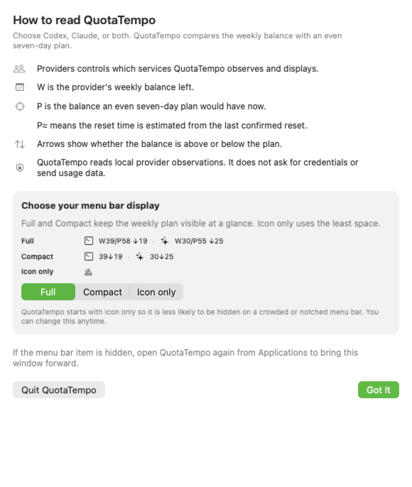
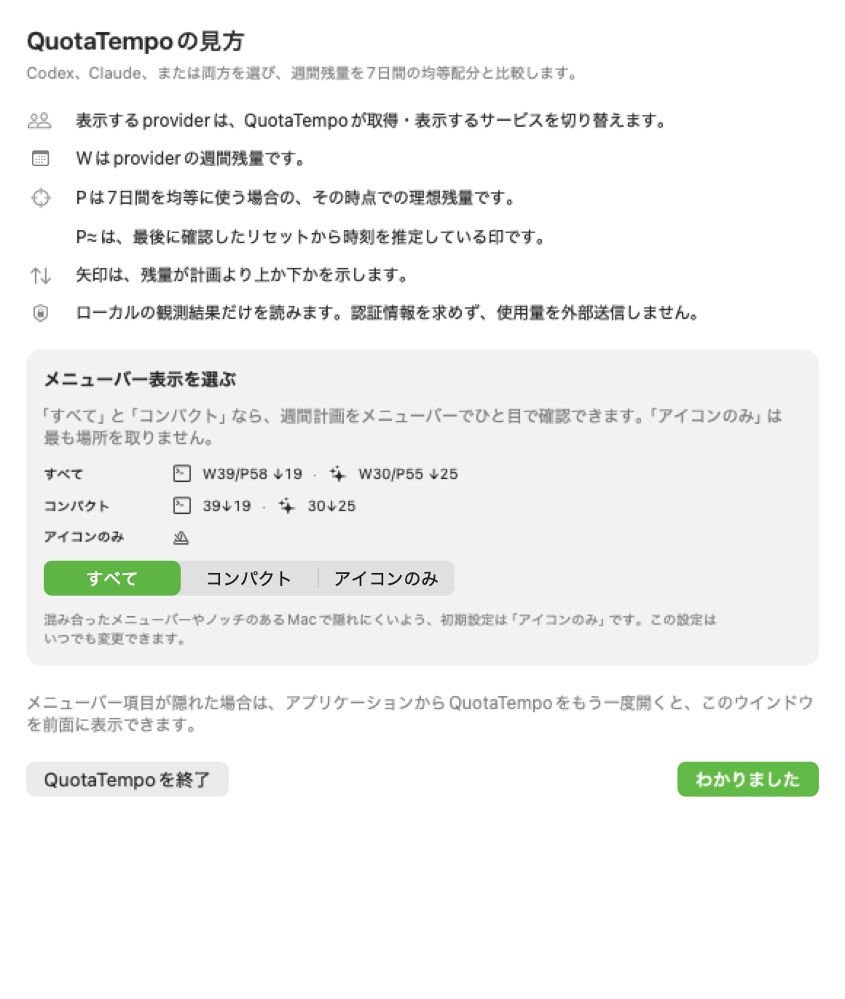
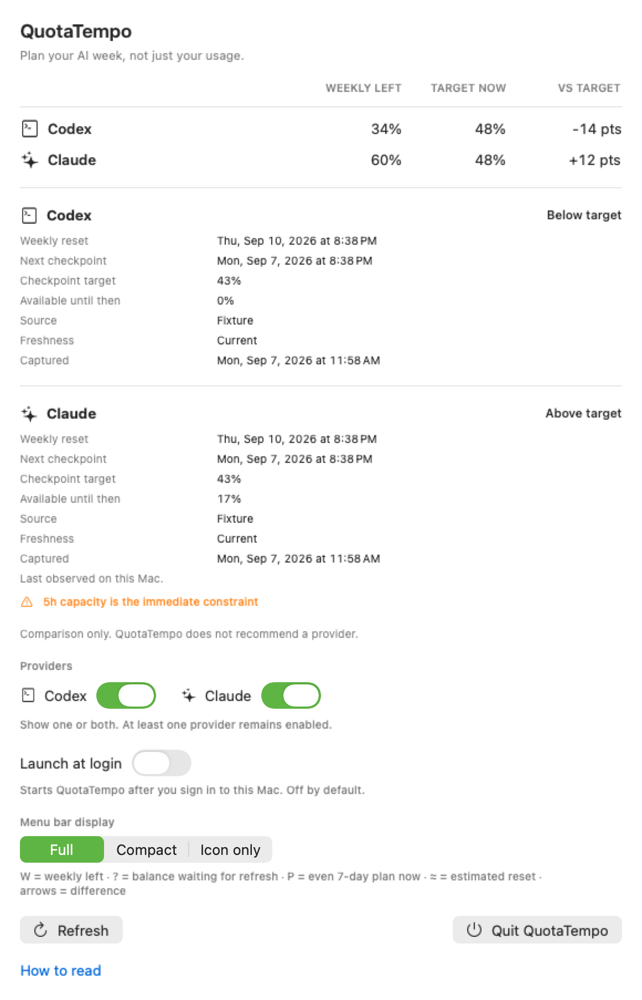
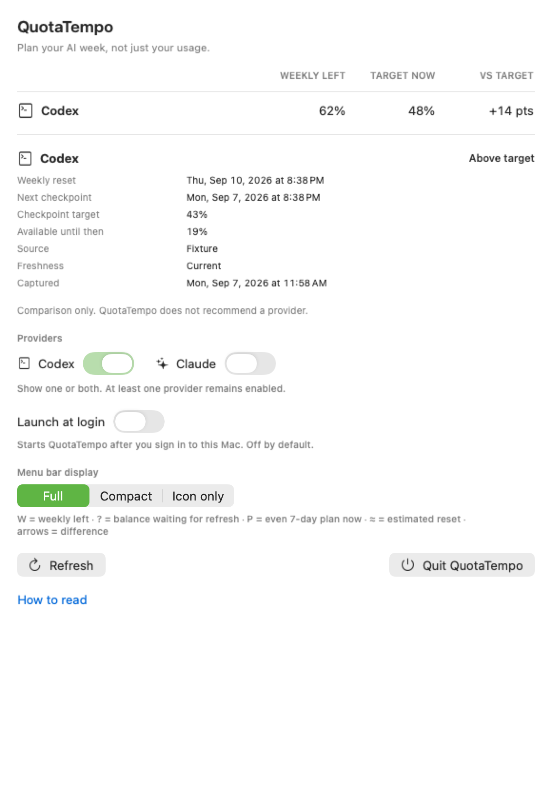
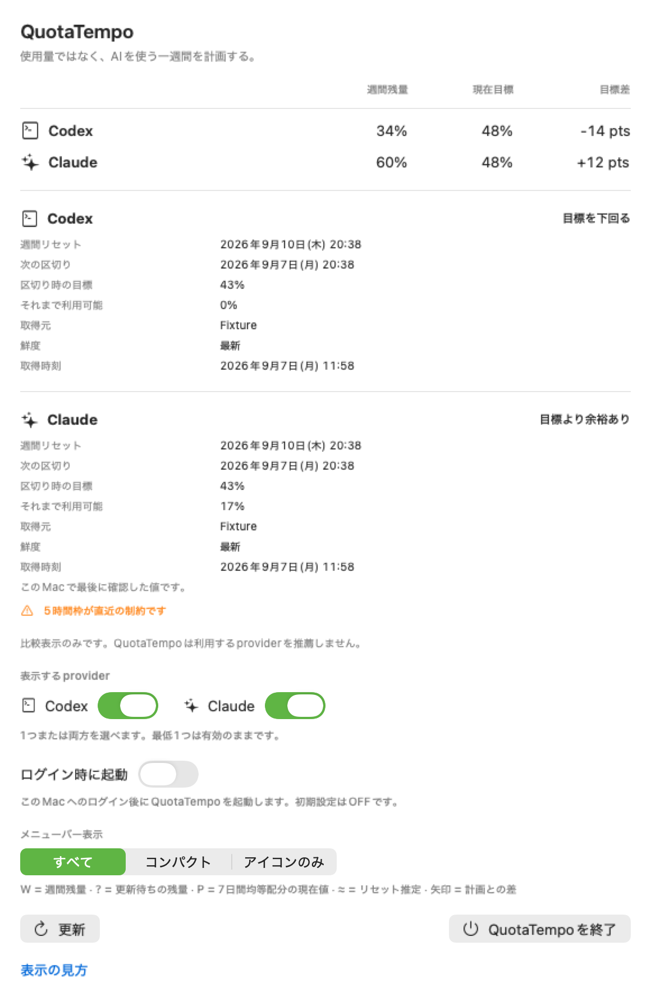
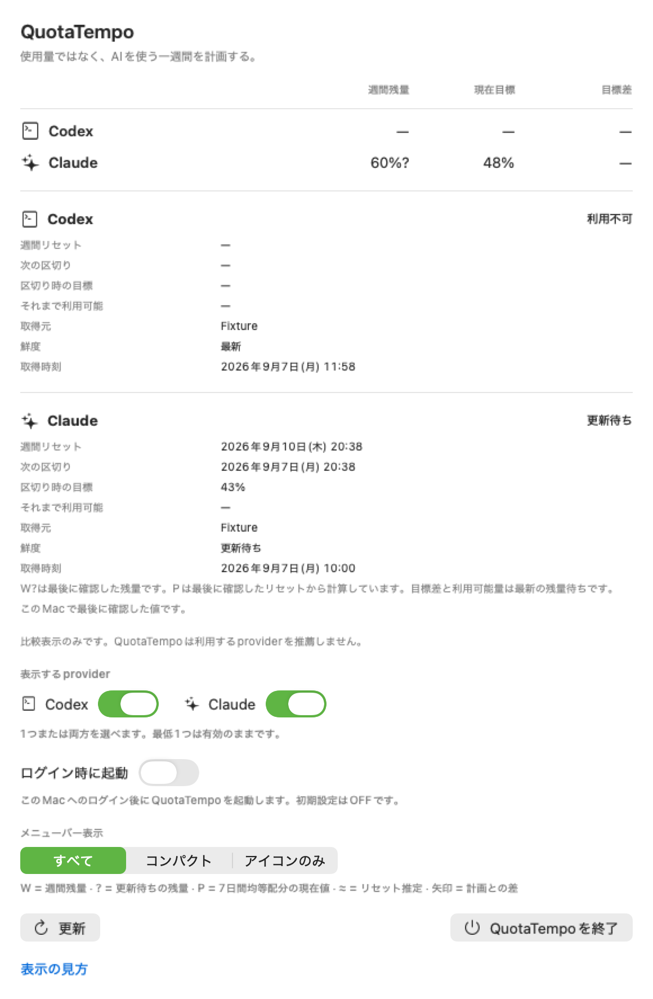

# QuotaTempo

> Plan your AI week, not just your usage.

[](https://github.com/Ishikawa-Hidekazu/quota-tempo/actions/workflows/ci.yml)
[](LICENSE)
[](docs/user-guide.md)

QuotaTempo is a weekly AI capacity planner for Codex and Claude. Use either provider by itself or compare both. It is intended to show what you can use today before the weekly reset, without turning provider credentials or session history into application data.

V1 presents accurate numbers and a neutral side-by-side comparison. It does not recommend which provider to use; each user makes that decision from their own work context.

## Status

QuotaTempo 0.1.0 Public Beta is being prepared for release and remains under active development. Once published, public builds will be signed with a Developer ID, notarized by Apple, and distributed through [GitHub Releases](https://github.com/Ishikawa-Hidekazu/quota-tempo/releases/latest). The public beta has no time limit. The delivery model and pricing of future releases or additional features have not been decided.

The current beta contains deterministic planning math, a native macOS menu-bar app with a focused first-run and reopenable application window, a bounded Codex app-server reader with verified official-desktop discovery and capability fallback, a hardened local snapshot store, an automatic local-first Claude adapter, provider selection, opt-in login launch, actionable compatibility diagnostics, and direct access to the bundled product policies.

## Download

After publication, download the notarized ZIP and its SHA-256 from the [latest GitHub release](https://github.com/Ishikawa-Hidekazu/quota-tempo/releases/latest). QuotaTempo currently supports Apple silicon Macs running macOS 14 or later.

1. Verify the downloaded ZIP against the SHA-256 published in the release.
2. Unzip it and move `QuotaTempo.app` to `/Applications`.
3. Open QuotaTempo from Applications. The first-run window explains the menu-bar modes.

Do not bypass Gatekeeper if macOS rejects the app. See the full [installation and usage guide](docs/user-guide.md) or the [Japanese guide](docs/user-guide.ja.md).

## Product focus

The primary view is weekly:

```text
         WEEKLY LEFT   TARGET NOW   VS TARGET
Codex            34%          48%      -14 pts
Claude           60%          48%      +12 pts
```

The detail view may add:

- Weekly reset
- Next checkpoint
- Checkpoint target
- Available until then
- Status

`TARGET NOW` is the ideal remaining capacity at the current instant. **Weekly reset** is the end of the provider's current weekly quota window. **Next checkpoint** is the next 24-hour planning boundary counted backward from that reset, not a local calendar-day boundary. Detailed timestamps include the localized weekday. A safely projected Claude reset is labeled **Weekly reset (estimated)** and also marks the plan as `P≈`. Differences are percentage points (`pts`), not percentage changes.

Five-hour quota is secondary. It belongs in detail or in an immediate-risk warning, not in the primary weekly table.

The menu-bar label is weekly-first and can be changed inside the popover:

```text
Full       Cx W34/P48 ↓14 · Cl W60/P48 ↑12
Compact    Cx 34↓14 · Cl 60↑12
Icon only  [neutral metronome glyph]
```

`W` means weekly capacity left, `P` means an even seven-day reset-relative plan at the current instant, and the arrow shows how far the balance is above or below that plan. `W?` marks the last observed balance while a current refresh is pending; QuotaTempo withholds its difference from `P`. Icon only is the first-run default so a crowded or notched menu bar is less likely to hide the item. The focused first-run guide previews and selects all three modes, and the choice remains available in the operational view. It is stored by QuotaTempo itself and does not change provider settings. QuotaTempo does not assume a weekday-only work schedule in V1.

The menu bar uses neutral monochrome SF Symbols to distinguish the rows; it does not bundle provider logos. The text abbreviations remain in VoiceOver output. Trademark boundaries are recorded in [THIRD_PARTY_NOTICES.md](THIRD_PARTY_NOTICES.md).

## V1 boundary

- Providers: Codex, Claude, or both. At least one remains enabled.
- Codex candidate source: a bounded read through the official Codex app-server.
- Claude candidate sources: Claude Desktop plan history, Claude Code's local usage cache, and a compatible-window merge of those local observations. An experimental CLI decoder remains test-only because the current official CLI did not return quota windows to a bounded `get_usage` control request.
- Claude model-specific weekly buckets and Extra Usage are excluded until a stable official contract exists.
- CodexBar is a reference and competitor, not a runtime dependency.
- Provider adapters normalize only recognized quota metadata. Raw provider responses are not stored.

## Build and test

For the signed and notarized public beta, start with the [installation and usage guide](docs/user-guide.md). A [Japanese guide](docs/user-guide.ja.md) is also available. Ad-hoc development packages are local verification artifacts and must not be redistributed as public builds.

Requirements: macOS 14 or later and Swift 6.

```bash
swift build
swift test
./scripts/render-fixture-proof.sh
./scripts/test-menu-bar-refresh.sh
```

The final command launches a provider-disabled, isolated QA bundle and verifies through macOS accessibility metadata that a closed menu-bar label adopts a newly available reset time through its one-minute clock. It does not click the menu or read the installed app's storage.

Build a local menu-bar-only macOS app bundle with a deterministic file inventory:

```bash
./scripts/build-app-bundle.sh
open dist/QuotaTempo.app
```

The bundle sets `LSUIElement`, places the app at `Contents/MacOS/QuotaTempo`, its original application icon at `Contents/Resources/QuotaTempo.icns`, localization resources at `Contents/Resources/QuotaTempoCoreResources`, and the license/privacy/support/update documents under `Contents/Resources`. Development-only fixtures and the rollback-only Claude bridge are not included. It records per-file SHA-256 values at `Contents/Resources/SHA256SUMS`. It never installs a login item automatically. A user may opt in through **Launch at login** only after moving the app to `/Applications` or the user's `Applications` folder. Provider-disabled QA copies never query the macOS login-item service. Distributed binaries are checked for developer home paths.

The current beta support matrix is macOS 14 or later on Apple silicon, with the official Codex app or CLI and Claude Desktop or Claude Code already signed in. QuotaTempo does not perform either provider's login. Unsupported or changed provider data fails closed. When Claude supplies a current balance after its last confirmed reset expires, QuotaTempo may project that exact weekly cadence once only when the new balance has increased, and marks the plan with `≈`. It never chains estimates. A valid weekly balance without confirmed or one-window projected timing remains visible, while its plan is labeled **Reset time unavailable**. Claude Desktop history does not supply that reset metadata; using Claude Code once can create the compatible local observation needed for `P`. A balance still attached to an elapsed reset is hidden as **Waiting for new quota window** until a current observation arrives.

To create a local release candidate from a clean tree, run:

```bash
./scripts/package-release.sh dist/release
./scripts/verify-release.sh dist/release --skip-launch
```

This produces an RC-identified ad-hoc signed ZIP, external SHA-256 file, and metadata record for local QA. Repeated ad-hoc packaging from the same clean commit is byte-identical. Package-time verification checks the embedded source commit, build, channel, signature class, icon, architecture, and developer-path boundary without launching the extracted production-identifier copy. The dedicated isolated QA scripts use provider-disabled or QA-identifier bundles and cannot query the user's login-item record. Public distribution requires a Developer ID signature and Apple notarization; the ad-hoc artifact is not a public release.

After creating a Developer ID-signed release directory, submit it through an owner-managed Keychain notary profile and write the stapled artifact to a new directory:

```bash
./scripts/notarize-release.sh dist/signed dist/notarized KEYCHAIN_PROFILE
```

The script validates the signed input, performs one `notarytool --wait` submission, staples the accepted ticket, verifies it with `stapler` and `spctl`, then regenerates the ZIP, SHA-256, and release metadata without overwriting the signed input. It does not accept Apple credentials as command-line arguments.

`verify-release.sh` accepts a Developer ID-signed stable intermediate before notarization. Use `--require-notarized` only for the final public artifact; `notarize-release.sh` applies that stricter check automatically after stapling.

Run the fixture-only menu-bar app locally:

```bash
swift run QuotaTempo
```

The app reads its own schema-versioned normalized Application Support records and two recognized Claude usage subtrees. Snapshot reads are size-bounded and reject symlinks, non-regular files, invalid provider/source combinations, and invalid state or window semantics; one explicit pre-RC13 unversioned format remains readable for upgrade continuity. It combines the newest local utilization with a reset timestamp only when both observations belong to the same quota window. On launch, every 15 minutes while running, after the Mac wakes, and when the user chooses **Refresh**, it refreshes only enabled providers. It may ask the installed official Codex app-server for rate-limit metadata through a bounded child process and rereads the recognized local Claude observations. Menu-open and automatic refreshes retain a five-minute last-attempt guard and one-in-flight limit per provider. Cached presentation appears before normalized storage and provider preparation continue away from the main actor. Codex checks at most three recognized candidates. A desktop-bundled executable is accepted only when the outer app and nested executable satisfy the pinned OpenAI identifier and Team ID requirements with strict nested-code validation. Capability failures may fall through to the next candidate; an explicit provider restriction stops immediately. A normalized version probe runs only after all candidates fail, and known `0.133.x` or earlier installations receive an update-specific message. It does not decode or retain provider credentials, tokens, cookies, Keychain values, prompts, transcripts, sessions, organization identifiers, local paths, or raw responses.

The first launch focuses an independent application window so opening QuotaTempo has an immediate visible result even when its menu-bar item is hidden behind a notch. The guide explains provider selection, `W`, `P`, `P≈`, and the comparison arrows, previews Full, Compact, and Icon only, and lets the user choose among them without requiring provider credentials. Opening QuotaTempo again from Applications brings the window forward; opt-in login launch remains silent after onboarding. Reopen the guide with **How to read**. In Compact mode, an estimated plan is shown as `75↑25 P≈`, so the marker cannot be mistaken for an estimate of the measured weekly balance. **Copy diagnostics** places only the app version, operating-system version, enabled providers, source kinds, freshness, and acquisition states on the clipboard; quota percentages, reset times, paths, credentials, and session content are excluded. The **Legal** menu opens the bundled license, privacy policy, update policy, third-party notices, and support route.

Use **Quit QuotaTempo** at the bottom of the popover to stop the app. To uninstall, first turn off **Launch at login** if enabled, quit the app, and remove `QuotaTempo.app`. Its normalized local snapshot directory is documented in [PRIVACY.md](PRIVACY.md) and may be removed separately if the user wants to erase the last displayed observations. The same policy documents the `co.ishikawa.QuotaTempo` preference domain for erasing display, provider-selection, and onboarding preferences.

## Fixture-only visual proof

| English first-run guide | Japanese first-run guide |
| --- | --- |
|  |  |

| English baseline | Codex-only selection |
| --- | --- |
|  |  |

| Japanese baseline | Japanese degraded-state proof |
| --- | --- |
|  |  |

## Safety boundary

QuotaTempo must not read token, cookie, credential, or Keychain contents. Its Claude adapter decodes only the recognized usage-history and cached-utilization structures, applies file-size and symlink checks, and stores only normalized percentages, reset times, the reset-estimate marker, source, freshness, and acquisition state. Browser session and direct OAuth access are excluded.

QuotaTempo does not route prompts, switch accounts, bypass quotas, record sessions, or silently infer unavailable provider data. Its only timing estimate is the visibly marked, non-chainable one-window Claude reset projection described above.

Provider subprocess input uses a bounded pipe with SIGPIPE suppression and a throwing write path, so an executable that exits before reading cannot terminate QuotaTempo. Timeout and app-exit cleanup terminate the discovered process tree, allow a short graceful-exit interval, and then kill any surviving descendants. Snapshot-save failures preserve the new normalized observation in memory and display a metadata-only write error instead of silently reverting to an older value.

V1 also does not issue provider directives such as `Use Claude today`, infer the user's task, or optimize provider selection.

## Contributing

Issues and pull requests are welcome. Please read [CONTRIBUTING.md](CONTRIBUTING.md) before proposing a change. Never attach provider source files, credentials, tokens, cookies, prompts, transcripts, or personal quota values to a public issue.

## Design specification

See [docs/product-spec.md](docs/product-spec.md).

The live-adapter implementation and isolated Claude lifecycle are documented in [docs/live-adapter-mvp.md](docs/live-adapter-mvp.md).

Security and local-data boundaries are documented in [SECURITY.md](SECURITY.md) and [PRIVACY.md](PRIVACY.md). License, support, and update terms are in [LICENSE](LICENSE), [SUPPORT.md](SUPPORT.md), and [UPDATES.md](UPDATES.md).

QuotaTempo is independent software and is not affiliated with, endorsed by, or sponsored by OpenAI or Anthropic.
