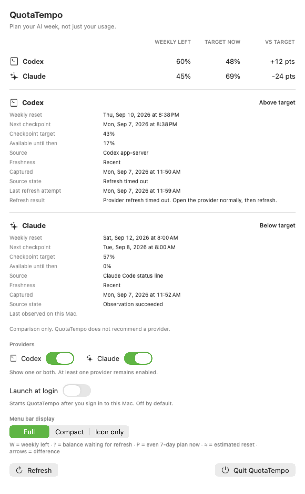

# Live-adapter MVP

Status: implemented for the public beta.

## Data flow

QuotaTempo stores only normalized provider metadata under its own Application Support directory:

- provider and source identifiers
- capture time and bounded acquisition state
- remaining percentage, duration, and reset time for recognized windows
- Codex last-attempt time and a stable local error category
- Codex executable provenance and a normalized semantic version when a bounded failure-only probe supplies one

It does not persist raw provider responses or raw Claude source files. It does not decode or retain credentials, tokens, cookies, Keychain values, sessions, prompts, transcripts, or organization identifiers.

## Codex

For enabled providers, the app performs a bounded refresh on launch through the installed official `codex app-server --stdio` process. It also refreshes every 15 minutes while running and after a macOS wake notification, offers explicit refresh, and may refresh when the menu opens if the last attempt is at least five minutes old. Only one attempt may be in flight. Disabled providers are omitted from acquisition and presentation while their normalized observations remain stored for safe re-enablement. The one-minute UI clock and both automatic publishers are attached to the persistent menu-bar label rather than the popover, so closing the popover does not stop freshness updates or provider scheduling. Cached presentation appears immediately; normalized storage reloads and provider preparation run away from the main actor. The adapter sends the documented initialization handshake and `account/rateLimits/read`, keeps standard input open until response ID 2 arrives, and then:

- limits the attempt to 5 seconds
- limits combined standard output and error to 1 MiB
- terminates the discovered child-process tree on timeout
- accepts only the response matching its request identifier
- classifies five-hour and weekly windows by duration
- requires valid percentage, duration, and reset metadata
- stores only a normalized snapshot
- preserves a previous normalized snapshot when refresh fails

The child receives a minimal environment containing only `HOME`, a fixed `PATH`, `TMPDIR`, and `LANG`. Codex owns its authentication; QuotaTempo does not open authentication storage. If Codex reports that ordinary usage is unavailable, spend control is reached, or a rate-limit restriction is active, QuotaTempo hides the percentages and exposes a stable restricted state instead of inferring recovery from reset metadata.

For a bounded development smoke that writes only to a caller-selected temporary path:

```text
QuotaTempoBridge refresh-codex --output /temporary/path/codex.json
```

The official generated schema permits a named `codex` snapshot with nullable windows alongside the required backward-compatible `rateLimits` snapshot. The adapter therefore accepts a named snapshot only when it contains a valid weekly window, then retains a valid five-hour window when present. It falls back to `rateLimits` when the named snapshot is empty, malformed, or five-hour-only. Synthetic fixtures lock each path.

The same generated protocol schema defines `usedPercent` as `int32 / integer`. Decimal values are therefore rejected as schema drift rather than silently widened. The adapter tries no more than three ordered Codex candidates. A directly nested executable from an official desktop app comes first only after Security.framework validates the Apple Developer ID chain, exact outer and nested identifiers, Team Identifier `2DC432GLL2`, strict nested-code validity, and a symlink-free nesting path. Recognized user-local, nvm, package-manager, and system locations follow. Capability failures may fall back; an explicit usage restriction never does. The child executable directory is prepended to its minimal `PATH`, allowing a user-selected Node installation to satisfy an `/usr/bin/env node` shebang without inheriting the caller's full environment.

If every candidate fails, a deterministic priority preserves output-ceiling, timeout, launch, protocol, and temporary-failure distinctions. QuotaTempo then makes one separate two-second, 4 KiB `--version` probe only for the selected failure. `0.133.0` is the only empirically established incompatible version and `0.153.4` is the observed working version, so only `<= 0.133.0` is labeled version-too-old; the unproven interval is not guessed. Only normalized provenance and a strict three-part semantic version may persist. Executable paths and raw version output never persist.

One separately approved metadata-only probe confirmed that the process exited normally after standard input closed but before response ID 2 arrived. Raw provider output and quota values were not retained. The transport now waits for the matching result or error envelope before closing input, while retaining the same timeout, combined output limit, and process-tree termination boundaries. A local subprocess fixture locks the response-before-EOF contract; no second live probe was run.

The shared subprocess runner sets `F_SETNOSIGPIPE`, makes provider input nonblocking, and applies one monotonic wall-clock deadline to input delivery and process completion. Response-triggered input closure and each nonblocking write share one lock, preventing close/write descriptor reuse races. If a provider exits before consuming input, the write is classified without terminating the app; if it stays alive without reading, the same bounded timeout terminates the discovered process tree. JSON response detection consumes each completed output line once instead of repeatedly reparsing accumulated output. Blocking process work runs on a dedicated utility queue rather than Swift's cooperative executor. The runner registers every active direct child, discovers descendants recursively, sends `SIGTERM`, allows a short grace interval, and then sends `SIGKILL` only to survivors. App termination asks the same registry to stop every active provider process.

## Claude

The app refreshes Claude on the same launch, 15-minute schedule, system-wake, menu-open, explicit-refresh, one-in-flight, and five-minute attempt boundary used by Codex. It acquires account-wide five-hour and weekly utilization without requiring CodexBar:

1. It reads Claude Desktop's `plan-usage-history.json` with an 8 MiB ceiling and rejects non-regular or symlink-selected paths. The newest sample supplies observed utilization but not a reset timestamp.
2. It decodes only `cachedUsageUtilization` from Claude Code's local configuration with an 8 MiB ceiling. When Desktop history is newer, QuotaTempo combines its utilization with cached reset timestamps only if both observations fall within the same five-hour or weekly window. A complete current local result supplies utilization and reset timestamps without launching a process.
3. V1 stops after the bounded local reconciliation. An experimental official-CLI decoder remains covered by isolated fixtures but is disabled in the release path. A metadata-only live check of the current CLI's `get_usage` response confirmed a rate-limit-availability indicator but no five-hour or weekly quota windows, so launching it would not improve the display.

Malformed percentages, future observation times, incompatible observation windows, oversized files, or schema drift fail closed. An expired, unparsable, or implausibly distant reset is discarded without discarding its independently valid utilization. The newest valid local reading is retained, including its own valid reset; an older snapshot supplies a reset only when the newer observation lacks one and both belong to the same window. After one confirmed weekly reset elapses, a newer Desktop observation from the immediately following window may advance that exact reset by one seven-day duration. The normalized window records this as estimated, the UI renders `P≈`, and an estimated reset can never be advanced again. A new exact reset replaces it automatically. Without either a compatible exact reset or that one-window projection, QuotaTempo shows the observed weekly balance while withholding target, difference, and checkpoint calculations; the detail status is **Reset time unavailable**, not a provider-wide **Unavailable**. For a Claude Desktop-only balance, the UI explains that Claude Code must create compatible local reset metadata before `P` can be shown. A valid fresh five-hour window continues to drive its independent immediate-risk warning when the weekly window is absent.

The selected adapter never opens browser cookie databases, reads Keychain or OAuth values, refreshes provider tokens, calls the Claude web usage endpoint, records prompts, or persists a Claude session. Only normalized percentages, duration, reset when present, its estimate marker, capture time, source, and acquisition state enter QuotaTempo storage.

For a bounded development check that writes only normalized data to a caller-selected temporary path:

```text
QuotaTempoBridge refresh-claude --output /temporary/path/claude.json
```

### Retired status-line path

`QuotaTempoBridge ingest-claude --output PATH` and the reversible status-line lifecycle remain development-only because their bounded input, coexistence, rollback, and ownership-drift behavior is tested. Claude Desktop did not execute the configured status line in the accepted live check, so the app does not depend on or activate this path.

The retired lifecycle still fails closed with stable metadata-only codes. In particular, activation, rollback, or uninstall against a missing Claude settings file returns `missing_settings` and leaves any owned backup and wrapper available for deliberate recovery.

The lifecycle commands are implemented for isolated testing and future explicit activation:

```text
claude-activate --consent --settings PATH --install-dir PATH --bridge PATH --output PATH
claude-status   --settings PATH --install-dir PATH --bridge PATH --output PATH
claude-rollback --settings PATH --install-dir PATH --bridge PATH --output PATH
claude-uninstall --settings PATH --install-dir PATH --bridge PATH --output PATH
```

Activation refuses to run without `--consent`, rejects symlink-selected paths, records only the previous `statusLine` ownership state, installs an app-owned wrapper atomically, and forwards the bounded in-memory status-line payload to both QuotaTempo and an existing status-line command. The bridge accumulates partial pipe reads until EOF or the total input ceiling, so a short first read cannot truncate a valid payload. The wrapper does not save the raw payload. Rollback restores only the `statusLine` subtree while preserving unrelated settings changed after activation. Unexpected status-line ownership drift fails closed. Uninstall removes managed files only when QuotaTempo still owns the active subtree or the recorded previous subtree is already restored; any other state preserves settings and ownership records for manual resolution.

These commands must not be applied to a real Claude configuration. They are not part of current onboarding or automatic acquisition.

## Local app bundle

`scripts/build-app-bundle.sh` creates `dist/QuotaTempo.app` with `LSUIElement=true`, one production executable, localization resources, policy documents, and a sorted per-file SHA-256 inventory. Development fixtures and the rollback-only bridge remain in the source tree but are excluded from the app bundle. It assigns ordinary distributable modes: `755` for directories and the executable, and `644` for resources and metadata. It refuses to replace an existing output path. `scripts/test-app-bundle.sh` builds two independent copies, compares inventories, validates every hash and mode, confirms the development-only files are absent, launches one through LaunchServices with providers disabled, exercises launch, menu-open, scheduled-refresh, system-wake, and explicit-refresh trigger paths, confirms process persistence, confirms no provider record was created, terminates the fixture-only process, and removes its exact temporary directory. Provider-disabled composition injects an unavailable login-item boundary, so the temporary production-identifier copy never queries `SMAppService` or rewrites the owner's Background Task Management record.

QuotaTempo never adds itself to Login Items automatically. RC16 exposes the opt-in `SMAppService` control only when the running bundle is inside `/Applications` or the user's `Applications` folder; other copies show a move-first explanation and do not construct or query the service. On a first launch, macOS may report `.notFound` until the first Background Task Management record is created; QuotaTempo treats that state as registrable and surfaces any actual registration error after the user opts in. macOS remains the source of truth and the UI reports when System Settings approval is required but not yet active. To roll back a future Claude activation, run the tested lifecycle rollback before removing the app. To uninstall, first disable login launch if enabled, run lifecycle uninstall while the ownership record is available, quit QuotaTempo, and then remove only the selected `QuotaTempo.app`, app-owned Application Support directory, and its display, provider-selection, and onboarding preferences after reviewing any retained normalized metadata or ownership backup.

## Menu-bar presentation

The app exposes three display modes in the popover and stores the selection in its own user defaults:

```text
Full       Cx W34/P48 ↓14 · Cl W60/P48 ↑12
Compact    Cx 34↓14 · Cl 60↑12
Icon only  [neutral metronome glyph]
```

Icon only is the first-run default because it consumes the least menu-bar width. The focused first-run guide previews Full, Compact, and Icon only with the same provider glyphs and representative values, and both the guide and operational view can change the persisted selection. The visual label uses neutral monochrome SF Symbols in place of `Cx` and `Cl`; QuotaTempo does not bundle provider logos. VoiceOver retains the provider names and complete values. `W` is weekly capacity left, `W?` is the last observed balance while a current refresh is pending, `P` is the current even seven-day reset-relative plan, `P≈` identifies the one-window Claude reset projection, and the signed arrow is the difference between current values. The title is comparison-only: it does not choose a provider or infer what the user should work on. Missing providers and unsafe comparisons render as unavailable. The formatter and popover share the same first-record-wins provider deduplication. They are deterministic, follow provider order, tolerate duplicate provider records without SwiftUI identity collisions, and update from the app's normalized scenario rather than directly polling a provider.

The complete non-icon label is rendered into one intrinsic template `NSImage` before it is passed to `MenuBarExtra`. This avoids a macOS sizing failure observed with a multi-child SwiftUI label, where the status item allocated width for the Codex segment but clipped the Claude segment even when the menu bar had free space. The composite image measures whichever provider segments are enabled in one width; VoiceOver continues to receive the canonical text label rather than image content.

## Current hardened release-candidate installation

The current source is the `0.1.2` public-beta baseline. The bundle exposes its semantic version and release-candidate channel in the operational view. A first launch presents and focuses an independent window; reopening the already-running app restores it from the Dock if needed, refreshes current state, and brings it forward. Provider-disabled QA remains silent, and login launch remains silent after onboarding. The menu-bar popover caps its viewport at 720 points to preserve attachment to the status item and keeps all remaining content reachable in its ScrollView. The independent window retains the larger operational content range. Both surfaces still clamp to the screen's visible height so smaller displays retain a stable, visible scrollable fallback through the final action and policy rows. Existing users with no explicit saved display mode retain the earlier implicit Full mode, while new installations default to Icon only. The first-run guide includes localized visual mode previews and completion actions without clipping. Provider detail shows the weekly reset separately from the next 24-hour planning checkpoint, includes the localized weekday in every detailed timestamp, and labels a safely projected Claude reset as estimated. An isolated provider-disabled acceptance run must also prove that a closed menu-bar label changes from an unknown plan to a calculated plan through the one-minute clock, without a click, provider call, or login-item service access, and that every action and policy link exposes an explicit accessibility name.

Only exact clean-tree packages with the pinned Developer ID identity, Apple notarization, published SHA-256, and acceptance evidence are public distribution artifacts. Development and ad-hoc packages remain local-only.

## Error and freshness behavior

Acquisition state and snapshot age remain separate. A failed refresh never makes old data newer. `capturedAt` remains absent until a valid observation succeeds; attempt time is stored separately. If atomic persistence fails, the newly normalized value remains as a transient in-memory display override with `atomicWriteFailed`; ordinary reloads do not silently replace it with the older disk record. A later successful save clears the override. Claude UI copy states that the value was last observed on this Mac and identifies whether it came from Desktop history, local cache, or compatible merged local sources. CLI and status-line source labels remain decodable only for development fixtures and older local records.

Stale snapshots retain the last-observed weekly remaining capacity as `W?`. While a confirmed reset or one permitted one-window estimate remains valid and in the future, they also retain the independently reset-derived current target, next checkpoint, and checkpoint target. They do not produce a target difference, capacity available until the checkpoint, five-hour risk, or any other calculation that treats the stale balance as current. The popover distinguishes confirmed and estimated reset bases and explains that balance-derived fields are waiting for a current observation. An elapsed reset is reported explicitly and hides every old-window value even when the capture itself is stale.

## Test boundary

Tests use fake Codex JSON-RPC results, fake Claude control responses, temporary Claude Desktop history and cache fixtures, real bounded local shell subprocesses, synthetic status-line input, and temporary settings directories. They cover local-first selection, first-run provider detection, single-provider filtering, the minimum-one-provider rule, the V1 no-CLI boundary, monotonic observation selection, compatible-window merge, one-window reset projection, refusal to chain estimates, per-window invalid and expired reset isolation, incompatible reset rejection, resolved symlink executables, experimental CLI isolation, environment overrides, early child exit, descendant-held pipe descriptors, descendant termination after timeout, serialized ordered output at process exit, refresh timing, the 15-minute schedule, clock-driven freshness changes, timeout, input and output ceilings, partial input reads, exact status-line payload forwarding, malformed percentages and resets, Codex usage restrictions, reset-unknown display, five-hour risk without a weekly window, displayed rounding consistency, never-observed defaults, source-only field exclusion, failed refresh preservation, visible atomic write failure as the next refresh input, duplicate-provider display, status-line coexistence, ownership drift, rollback, uninstall, selected-path symlink rejection, and resource lookup when SwiftPM is invoked outside the repository root. The app-bundle test exercises every trigger with providers disabled, validates distributable file modes and bundled policy documents, and requires both Codex and Claude records to remain absent.

## Automatic Claude metadata-only live check

One bounded local-source check selected `claudeLocalCache`, returned `observationSucceeded`, and contained five-hour and weekly windows with reset timestamps. A separate metadata-only `get_usage` compatibility check against the installed official Claude CLI confirmed that its current control response does not expose five-hour or weekly quota windows. Neither check emitted or retained quota percentages, reset values, organization identifiers, raw source JSON, credentials, cookies, tokens, prompts, sessions, or transcripts. The caller-selected temporary normalized files and directories were removed. V1 therefore keeps CLI acquisition disabled and relies only on the recognized local observations.

The following artifact is rendered exclusively from the bundled `live-adapters` fixture. It demonstrates that a failed Codex refresh remains separate from the age of the preserved snapshot and that Claude is labeled as a local observation.


