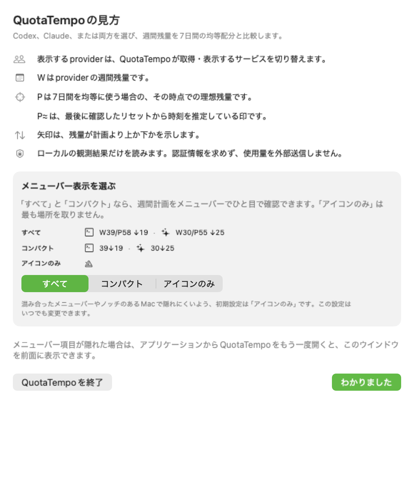

# QuotaTempoの導入と使い方

このガイドは、Developer ID署名とAppleのnotarizationが完了し、公式GitHub Releasesから配布されるQuotaTempoを対象にしています。
現在のリリースに利用期限はなく、開発は今後も継続します。
今後のリリースや追加機能の提供形態・価格は未定です。

## 動作条件

- macOS 14以降
- Apple silicon
- ログイン済みの対応providerが最低1つ：公式CodexアプリまたはCLI、Claude Desktop、Claude Code

CodexBarは必要ありません。QuotaTempo自身がproviderへログインすることも、token、cookie、API keyの入力を求めることもありません。

既定の**自動**取得では、Desktopの履歴だけで新しい確定リセット日時を取得できない場合があります。
バージョン0.1.10から、CLIへの追加ログインやChromeの常時起動を必要としない**Claude Desktop**接続を選べます。
接続には利用者の同意とmacOSのアクセス許可が必要です。
手順は下の「Claude Desktop接続」を確認してください。
従来の自動取得を使う場合は、同じアカウントでログイン済みの公式Claude Code CLIからもリセット日時を取得できます。

## 確認してインストールする

1. QuotaTempoのZIPと公開SHA-256を、同じ公式releaseページからダウンロードします。
2. Terminalでarchiveのhashを計算します。

   ```bash
   shasum -a 256 QuotaTempo-<version>-macOS.zip
   ```

3. 値全体が、そのreleaseで公開されたSHA-256と完全に一致することを確認します。
4. FinderでZIPをダブルクリックして展開し、Finder上で`QuotaTempo.app`を`/Applications`またはユーザーの`Applications`フォルダへドラッグします。macOSがユーザーによる移動として記録し、App Translocationから起動しないよう、展開と移動の両方をFinderで行ってください。
5. ApplicationsからQuotaTempoを開きます。初回案内ウインドウが前面に表示され、起動したこととメニューバー表示の選び方を確認できます。QuotaTempoはDockには表示されません。

公開版はApple Developer IDで署名し、Appleのnotarizationを通した状態で提供します。macOSに「開発元を確認できない」「アプリが壊れている」などと表示された場合は、そこで停止してください。Gatekeeperを迂回せず、公式配布元とSHA-256を再確認し、QuotaTempoのversionとmacOSの正確な表示内容を公開support窓口へ伝えてください。

## メニューバー表示の読み方

両方を有効にした場合、Full表示は次の形式で比較します。

```text
[Codex glyph] W34/P48 ↓14 · [Claude glyph] W60/P48 ↑12
```

- `W`はproviderが示した週間残量です。
- `W?`は最新の更新を待っている、最後に確認した週間残量です。現在の`P`との差を計算しないでください。
- `P`は週間resetから7日間均等に使う前提で計算した、その時点での理想残量です。
- `↑`は計画より余裕がある量です。
- `↓`は計画を下回っている量です。

差はpercentage pointです。QuotaTempoは数字を比較しますが、どちらを使うべきかは推薦しません。

メニューを開くと、次のreset基準checkpoint、checkpointでの目標残量、そこまで使える量、取得元、鮮度、取得時刻、取得状態を確認できます。5時間枠は、直近の制約になる場合だけ表示します。

## 表示量を選ぶ

混み合ったメニューバーやノッチのあるMacで隠れにくいよう、初期設定は**Icon only**です。初回案内ウインドウ、または後から**メニューバー表示**で三つの表示から選びます。

- **Full**：中立的なprovider識別glyph、週間残量、現在の計画、差
- **Compact**：中立的なprovider識別glyph、週間残量、差
- **Icon only**：中立的なmetronome glyphのみ。値は開いて確認

1回分のリセット推定を使う場合、コンパクト表示でも推定記号を計画側へ付け、`[Claude glyph] 75↑25 P≈`と表示します。

選択内容はQuotaTempo自身のmacOS設定へ保存します。CodexやClaudeの設定は変更しません。観測済みのリセット時刻がすでに過ぎている場合、古い週間残量は表示せず、現在の観測が届くまで**新しい利用枠を待機中**と表示します。

## 初回ガイドとログイン時起動

初回ガイドでは、provider選択、`W`、`P`、`P≈`、矢印の意味を説明します。Full、Compact、Icon onlyの見本も実際の表示に近い形で示し、その場で切り替えられます。表示言語が英語の場合は**Got It**、日本語の場合は**わかりました**を押すと通常の比較画面へ進みます。後から**表示の見方**で開き直せます。



小さい画面やmacOSの「文字を拡大」設定では、パネル自体が画面外へはみ出さない高さに自動調整されます。その場合は表示されるスクロール位置を使って、最下段の操作と**法的情報**まで確認できます。

メニューバー項目がノッチやほかの項目に隠れた場合は、ApplicationsからQuotaTempoをもう一度開いてください。起動中のQuotaTempoがアプリケーションウインドウを前面へ出し、同じ比較、設定、更新、終了操作を利用できます。初回案内の完了後、任意で有効にしたログイン時起動はウインドウを出さず静かに開始します。

各providerの詳細にある**週間リセット**は、providerの7日間枠が終了する日時です。**次の区切り**は、そのリセットから24時間単位で逆算した次の計画境界であり、別のリセットではありません。詳細日時には曜日も表示します。Claudeで最後に確認したリセットを安全に1週間だけ進めた場合は、**週間リセット（推定）**と表示します。日時が未取得・期限切れ・安全に使えない場合は`—`のままです。

## Codexのbanked resetを使った場合

OpenAIは、一度だけ使える[banked Codex reset](https://help.openai.com/en/articles/20001498-how-banked-codex-resets-work)を提供することがあります。full resetを適用すると、Codexの5時間枠と週間枠が更新され、週間リセット日も変わります。QuotaTempoは、reset特典の有無を探したり、resetを適用したり、有効期限を管理したりしません。

resetを適用した後は、Codexの設定 › 使用状況で新しい枠を確認し、QuotaTempoの**更新**を押してください。取得に成功すると、以前のprovider観測値を新しい枠で置き換え、`W`、`P`、区切りの予定を再計算します。自動またはglobal resetは、banked resetとして表示されず直接適用される場合があります。QuotaTempoはCodexから報告された枠に追従しますが、枠が変わった理由までは推測・表示しません。

QuotaTempoがLogin Itemsへ自動登録されることはありません。`/Applications`またはユーザーの`Applications`フォルダへ移動してから、**ログイン時に起動**を有効にしてください。ダウンロード、App Translocation、一時ディレクトリ、検証用コピーからはログイン項目を変更できません。macOS側の許可が必要な場合、その要求はまだ有効ではありません。表示に従ってシステム設定 › 一般 › ログイン項目で許可してください。アプリの移動、置換、アンインストール前にはこの設定をOFFにしてください。

## Providerを選ぶ

Desktop接続の値は保存対象外です。ClaudeをOFFにすると、その同意とメモリ上の表示値を消去します。

**表示するprovider**で、Codex、Claude、または両方を有効にできます。最低1つは有効のままです。無効にしたproviderはpopoverとメニューバーから消え、更新対象にもなりません。最後の正規化済み観測値はローカルに保持されるため、再び有効にしても履歴を破棄しません。取得失敗だけを理由に、QuotaTempoがproviderを自動で無効化することはありません。

初回起動時は、有効な観測値を確認できたproviderを選びます。どちらも検出できない場合は両方を表示し、利用者が明示的に選べる状態を保ちます。この設定はQuotaTempoの表示と取得だけを変え、providerのログアウトや設定変更は行いません。

## Claude Desktop接続

バージョン0.1.10で追加された機能です。
旧版にはこの操作は表示されません。
Claude Desktopをインストールし、ログインしておいてください。CLIへの追加ログインやChromeのタブは不要です。

1. 使用量の一覧のすぐ下にある**Claudeの取得元**を**自動**から**Claude Desktop**へ変更し、**Desktopへ接続**を選びます。
2. 画面内の説明を読んで**同意して接続**を選ぶと、確認欄が閉じて処理中の表示になります。macOSの許可が必要と表示されたら**macOSアクセスを許可**を選びます。システムの確認では、1回だけの**許可**ではなく**常に許可**を選びます。パスワードが必要な場合はシステムのダイアログだけに入力してください。
3. 接続の準備ができたら**次回取得予定（この時刻以降）**に従って待ちます。同意だけでは値は表示されず、取得の成功が必要です。再起動直後は、値をディスクに保存しないため空表示になることがあります。取得に成功すると、取得元が**Claude Desktop接続**になり、取得時刻・週間残量・リセット日時が表示されます。

この操作は、Claude Desktopの既存認証を端末内で利用するため、その保護キーへの継続アクセスをQuotaTempoに認めるものです。
認証情報の保存や会話の読み取りは行いません。
提供元の変更により、取得できなくなる場合があります。
有効化前に[Privacy（英語）](../PRIVACY.md)を確認してください。

Desktopを選んでいる間は、取得に失敗しても別アカウントのCLIやブラウザの値へ自動で切り替えません。
**接続解除**、ClaudeのOFF、取得元を**自動**へ戻す操作で、同意とDesktopの表示値を消去します。
再びClaudeをONにするだけでは再接続しません。macOS側の許可は残るため、取り消す場合は[許可取消手順（英語）](../PRIVACY.md#desktop-connection-removal)を使ってください。

通常の成功後は5分間隔で取得します。更新ボタンでも提供元の待機時間は短縮しません。
**接続を再確認**は回数を制限した復旧操作です。**取得記録を修復**は接続を解除して保存状態を修復しますが、確認済みの提供元の待機期限は消しません。
保存先を開けない場合は、その問題を解消してから接続し直してください。待機を回避するために保存ファイルを削除しないでください。

## Claude Codeの使用量比較

任意の**Claude Codeの使用量**欄では、明示的に接続したCodeセッションの週間・5時間枠を表示します。
通常のClaude行とは別枠で、アカウントと提供元の更新時刻が未確認のため、W/P・計画・自動取得元には反映しません。
通常のCodex・Claude取得はそのまま動作します。Code専用テストアプリが通常取得を停止するのは、公開版とは異なる検証用の仕様です。

[導入・解除手順（英語）](claude-code-usage.md)を使ってください。
導入時だけNode.js 20以降と、公式Claude Codeの2.1系CLI（2.1.287以降）が必要です。
Desktopのプラグイン設定画面ではなく、Terminalから同梱のlocal scope管理ツールを実行します。
QuotaTempo自身が比較のためにCLIやNode.jsを起動することはありません。
接続後、通常のCode作業中に計測された値が表示され、有効期限を過ぎると非表示になります。
接続解除・終了でメモリ内の接続を消去し、再起動だけでは再接続しません。

## 更新と鮮度

以下の15分周期はCodexとClaudeの**自動**取得の説明です。Desktop接続は上記の5分周期で動作します。

QuotaTempoは起動時、起動中の15分ごと、Macのスリープ復帰時に、有効なproviderだけを範囲限定で取得します。メニューを開いたときの更新にはprovider別の再試行間隔（Codexは5分、Claudeは14分）を適用します。Claudeの間隔を1分短くしているのは、timerのわずかな遅延で次の15分周期を取りこぼさないためです。自動更新とメニュー表示時の更新は、同じproviderの取得中に二重実行しません。**更新**を押すと、有効なproviderをすぐに再取得します。取得中は**更新中…**と表示し、buttonを無効化します。

- **最新**または**最近**の値は、計画と比較できます。
- **更新待ち**では、最後に観測した週間残量を`W?`として残します。リセットがまだ有効なら、`P`とリセットから求める区切りも表示しますが、目標差と利用可能量は最新の残量が届くまで表示しません。
- `P≈`は、最後に確認した週間resetを1期間だけ進めて現在の計画を推定している状態です。詳細画面にも根拠を表示します。新しいresetを取得すると自動で正確な値へ戻り、推定値から次の推定値を連鎖させません。
- **リセット時刻未取得**は、週間残量は有効でも計画計算に必要なreset日時がproviderから得られなかった状態です。`W`は残し、`P`と差を`—`で表示します。
- **利用不可**は、必要な情報が欠けている、無効、期限切れ、またはprovider側で形式が変わった状態です。
- **アクセス制限中**は、通常利用できないとproviderが明示した状態です。0.1.10では、利用枠の消費による制限と確認できた場合、providerが報告した残量（`0%`を含む）とリセット日時を表示します。ただし利用可能量は表示せず、制限が解除されたとも判断しません。理由が不明な制限や支出上限による制限では、percentageを隠します。

更新に失敗しても、古い観測値を新しい値として扱いません。有効なローカル残量を保持したままreset取得だけが失敗した場合は、残量と失敗した試行を分けて表示します。取得状態と観測時刻も別々です。

## Providerが利用不可の場合

1. 公式providerアプリまたはCLIがインストール済みで、ログインできていることを確認します。
2. provider自身のusage画面が通常どおり確認できることを確かめます。
3. QuotaTempoへ戻り、**更新**を1回押します。
4. 利用不可が続く場合は、**診断情報をコピー**を押し、その内容とproviderアプリまたはCLIのversionをsupportへ伝えます。

Codexの詳細画面では、未インストール、起動失敗、既知の旧version、上流protocol変更、timeout、出力安全上限、一時的な失敗を区別します。表示された対処を行ってから再度更新してください。QuotaTempoは署名を検証できた公式デスクトップ版を優先し、範囲を限定して代替候補も試すため、古いHomebrew版だけで正常なデスクトップ版が隠れることはありません。

コピーされる診断情報は、QuotaTempoとmacOSのversion、有効なprovider、正規化した取得元、Codex実行元の分類と正規化済みsemantic version（取得できた場合）、鮮度、取得状態だけです。percentage、reset日時、local path、raw version出力、credential、session内容は含みません。raw provider file、prompt、transcript、cookie、token、credential、private URLは送らないでください。上流のinterfaceが変化した場合、QuotaTempoは欠けた値を推測せず安全側で停止します。

## 更新する

公式releaseページまたは下記のHomebrewコマンドから、最新の公開版をインストールします。0.1.0以降の公開版はアプリ内更新に対応しています。

インストール後は、QuotaTempoの**アップデートを確認...**からいつでも確認できます。macOSの確認画面で自動チェックを有効にした場合、Sparkleは最大1日1回確認し、インストール前に更新内容を表示します。QuotaTempoが無断で強制更新することはありません。

Homebrewでは第三者Caskへの明示的なtrustが必要です。次の1行はQuotaTempoのCaskだけをtrustし、公開repoを配布元として登録して、同じnotarized releaseをインストールします。

```bash
brew trust --cask ishikawa-hidekazu/quotatempo/quotatempo && brew tap ishikawa-hidekazu/quotatempo https://github.com/Ishikawa-Hidekazu/quota-tempo.git && brew install --cask ishikawa-hidekazu/quotatempo/quotatempo
```

以後のコマンド更新には`brew upgrade --cask ishikawa-hidekazu/quotatempo/quotatempo`を使います。

この確認が通るまでは、直前の検証済みarchiveをrollback元として保持してください。

正規化済みの観測値は、別途削除しない限りQuotaTempoのApplication Support directoryへ残ります。

## アンインストールと観測値の削除

1. 任意のCodeプラグインを導入した場合は、先に[Codeの削除手順（英語）](claude-code-usage.md#before-removing-quotatempo)を行います。`removed`が返るまで、アプリ、展開済みパッケージ、管理用receiptを残してください。
2. **ログイン時に起動**が有効ならOFFにします。
3. **QuotaTempoを終了**を選びます。
4. `QuotaTempo.app`をゴミ箱へ移します。
5. 保存済みの観測値も消す場合は、次のファイルだけを削除します。

   ```text
   ~/Library/Application Support/QuotaTempo/codex.json
   ~/Library/Application Support/QuotaTempo/claude.json
   ```

6. 表示形式、provider選択、初回ガイドの設定も消す場合は、[Privacy](../PRIVACY.md)に記載した`co.ishikawa.QuotaTempo` preference domainを削除します。

他のプロジェクトがCodeパッケージを使っている場合や、管理操作の結果が未確定の場合は、Application Supportフォルダ全体を削除しないでください。
アプリを削除するだけではCodeプラグインは削除されません。共有パッケージと管理記録は保持します。

QuotaTempoを削除しても、CodexやClaudeの認証は変更されません。アプリ内の**規約・情報**から、bundle内のライセンス、プライバシー、更新方針、第三者表記、サポートを開けます。技術上の境界は[Security](../SECURITY.md)を確認してください。

Desktop接続を有効にした場合や別のプレビュー版を試した場合は、[許可取消手順（英語）](../PRIVACY.md#desktop-connection-removal)も確認してください。
macOSのキーチェーンアクセス許可は、公開版の保存データとは別で、アプリを削除するだけでは取り消されません。
Desktopの観測値は保存されません。再インストールを予定している場合は、提供元の待機期限を保つため更新予定の記録を残してください。
