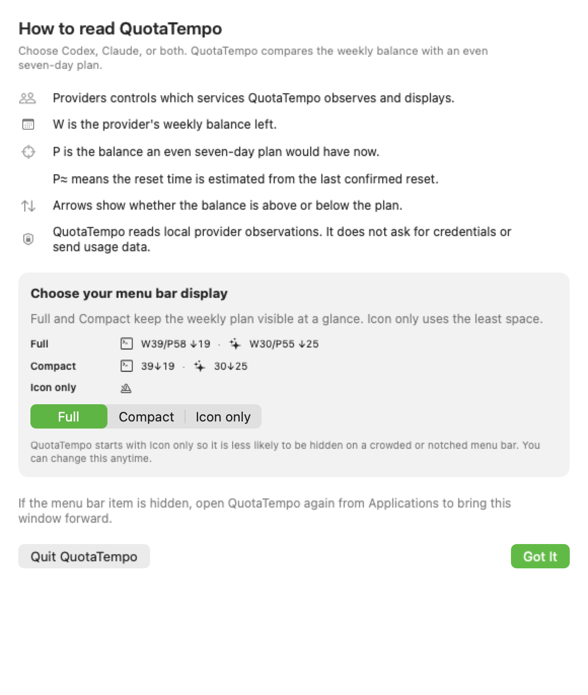

# Install and use QuotaTempo

This guide applies to the signed and notarized QuotaTempo release distributed through the official GitHub Releases page. The current release has no time limit, and QuotaTempo remains under active development. The delivery model and pricing of future releases or additional features have not been decided.

## Requirements

- macOS 14 or later
- Apple silicon
- At least one supported provider already signed in: the official Codex app or CLI, Claude Desktop, or Claude Code

QuotaTempo does not require CodexBar. It does not sign in to either provider and does not ask for provider tokens, cookies, or API keys.

## Verify and install

1. Download the QuotaTempo ZIP and its published SHA-256 from the same official release page.
2. In Terminal, calculate the archive hash:

   ```bash
   shasum -a 256 QuotaTempo-<version>-macOS.zip
   ```

3. Confirm that the complete value exactly matches the SHA-256 published for that release.
4. In Finder, double-click the ZIP, then drag `QuotaTempo.app` to `/Applications` or your user `Applications` folder. Perform both steps in Finder so macOS records the user-approved move and does not launch the installed app from App Translocation.
5. Open QuotaTempo from Applications. A focused first-run window confirms that it started and explains the menu-bar display. QuotaTempo does not add a Dock icon.

The public build must be signed with an Apple Developer ID and notarized by Apple. If macOS reports that it cannot verify the developer or that the app is damaged, stop. Do not bypass Gatekeeper. Recheck the official release source and SHA-256, then report the exact QuotaTempo version and macOS message through the published support route.

## Read the menu-bar label

With both providers enabled, the Full label compares them in this form:

```text
[Codex glyph] W34/P48 ↓14 · [Claude glyph] W60/P48 ↑12
```

- `W` is the provider-reported weekly capacity left.
- `W?` is the last observed weekly balance while a current refresh is pending. Do not subtract it from the current plan.
- `P` is the ideal remaining capacity at the current instant, calculated as an even seven-day plan from the weekly reset.
- `↑` is capacity above that plan.
- `↓` is capacity below that plan.

The difference is expressed in percentage points. QuotaTempo compares the numbers; it does not recommend which provider to use.

Open the menu to see the next reset-relative checkpoint, checkpoint target, capacity available until then, source, freshness, capture time, and acquisition state. Five-hour capacity appears only when it is an immediate constraint.

## Choose the label size

QuotaTempo starts in **Icon only** so it consumes the least space on crowded or notched menu bars. Choose another mode in the first-run window or later under **Menu bar display**:

- **Full**: neutral provider glyphs, weekly capacity, current plan, and difference
- **Compact**: neutral provider glyphs, weekly capacity, and difference
- **Icon only**: a neutral metronome glyph only; open it for all values

When a plan uses a one-window reset estimate, Compact mode keeps the marker on the plan basis: `[Claude glyph] 75↑25 P≈`.

QuotaTempo stores this display choice in its own macOS preferences. It does not change Codex or Claude settings. If an observed reset has already elapsed, the old weekly balance is hidden as **Waiting for new quota window** until a current observation arrives.

## First-run guide and login launch

The first-run guide explains provider selection, `W`, `P`, `P≈`, and the arrows. It also previews Full, Compact, and Icon only with representative values and lets you choose a mode directly. Choose **Got It** to open the normal comparison. Use **How to read** to reopen the guide later.



If the menu-bar item is hidden behind a notch or other status items, open QuotaTempo again from Applications. The existing process brings its application window forward, where the same comparison, settings, refresh, and quit controls remain available. After onboarding, opt-in login launch starts silently without opening this window.

On a smaller display or when macOS uses the Larger Text scaling option, QuotaTempo keeps the panel itself within the visible screen. A visible scroll indicator then provides access through the final action and Legal controls.

In each provider detail, **Weekly reset** is when the provider's seven-day window ends. **Next checkpoint** is the next 24-hour planning boundary leading to that reset, not another reset. Detailed timestamps include the weekday. Claude may show **Weekly reset (estimated)** when QuotaTempo can safely advance the last confirmed reset by exactly one seven-day window. Missing or unsafe reset timing remains `—`.

## If you use a banked Codex reset

OpenAI may occasionally provide a one-time [banked Codex reset](https://help.openai.com/en/articles/20001498-how-banked-codex-resets-work). Applying a full reset refreshes the five-hour and weekly Codex windows and changes the weekly reset date. QuotaTempo does not discover available offers, apply a reset, or manage its expiration.

After applying a reset, confirm the updated window in Codex Settings › Usage, then choose **Refresh** in QuotaTempo. A successful observation replaces the earlier provider-reported window and recalculates `W`, `P`, and the checkpoint schedule. An automatic or global reset can be applied directly without appearing as a banked reset. QuotaTempo follows the window reported by Codex but does not infer or label the reason for that change.

QuotaTempo does not add itself to Login Items automatically. Move it to `/Applications` or your user `Applications` folder before enabling **Launch at login**. A downloaded, translocated, temporary, or verification copy cannot change the login-item setting. If macOS requires approval, the request is not active yet; follow the message to System Settings › General › Login Items. Turn the option off before moving, replacing, or uninstalling QuotaTempo.

## Choose providers

Desktop connection is an exception to local observation retention: turning
Claude off revokes its consent and clears its memory-only values.

Under **Providers**, enable Codex, Claude, or both. At least one remains enabled. A disabled provider is removed from the popover and menu-bar label and is not refreshed. Its last normalized observation is retained locally, so re-enabling it can refresh from the last safe state. QuotaTempo never disables a provider merely because a refresh failed.

On first launch, QuotaTempo selects providers for which it can find an existing valid observation. If neither provider can be detected, both remain visible until you choose. This selection changes only QuotaTempo; it does not sign out of or reconfigure a provider.

## Claude Desktop connection

This connection was introduced in version 0.1.10. Older releases do not display
these controls. It does not require a Claude Code login or an
open Chrome tab, but Claude Desktop must already be installed and signed in.

1. Below the usage summary, change Claude's source from **Automatic** to
   **Claude Desktop**. Read the access notice and choose **Connect Desktop**.
2. Read the inline notice and choose **Agree and connect**. The notice closes
   immediately and a progress indicator appears while the connection is checked.
   If the app reports missing macOS permission, choose
   **Allow macOS access**. In the system dialog choose **Always Allow**, not
   one-time **Allow**. Enter any system password only in that dialog.
3. Once access is ready, follow **Next check (at or after)**. Values appear after
   a successful scheduled check, not merely after consent. A restart may initially show no values:
   Desktop observations are kept in memory only. A successful update displays
   **Claude Desktop connection**, its actual capture time, weekly balance and reset.

This grants QuotaTempo ongoing access to Claude Desktop's protection key, used
locally to read its existing authentication for usage retrieval. QuotaTempo does
not save the credentials or read conversations.
Provider changes may prevent QuotaTempo from retrieving usage data.
Review [Privacy](../PRIVACY.md) before enabling it.

Desktop is an exclusive source: failures do not silently switch to another
account in the CLI or browser. **Disconnect**, turning Claude off, or switching
back to Automatic revokes consent and clears the Desktop values. Turning Claude
on again does not reconnect without consent. These actions do not remove the
macOS permission; use the [permission-removal steps](../PRIVACY.md#desktop-connection-removal).

Successful polling normally waits five minutes. Refresh does not bypass a
provider wait. **Recheck connection** is a bounded recovery action, not a forced
refresh; **Repair scheduling state** disconnects and preserves known provider
deadlines. If storage cannot be opened, resolve the storage issue and connect
again. Do not delete scheduling files to bypass a wait.

## Refresh and freshness

The following 15-minute schedule applies to Codex and Claude Automatic. Desktop
connection uses the separate five-minute schedule described above.

QuotaTempo performs a bounded refresh for enabled providers when it starts, every 15 minutes while it remains running, and after the Mac wakes. Menu-open refreshes respect each provider's last-attempt guard (five minutes for Codex and 14 minutes for Claude; the shorter Claude guard prevents timer jitter from skipping a scheduled cycle). Automatic and menu-open refreshes never start a second request while the same provider is already in flight. Choose **Refresh** to request every enabled provider immediately. While an enabled provider is being checked, the control reads **Refreshing…** and is disabled.

- **Current** or **Recent** values can be compared with the plan.
- **Stale** preserves the last observed weekly value as `W?`. If its reset is still valid, QuotaTempo continues to calculate `P` and the reset-derived checkpoint schedule, but withholds the difference and available capacity until a current balance arrives.
- `P≈` means the current plan is estimated by advancing the last confirmed weekly reset exactly once. The detail view identifies this basis. A newly observed reset replaces the estimate automatically, and QuotaTempo never uses an estimate to create another estimate.
- **Reset time unavailable** means the weekly balance is valid, but the provider did not supply the reset timestamp needed to calculate the plan. QuotaTempo keeps `W` visible and shows `P` and the difference as `—`.
- **Unavailable** means required data was missing, invalid, expired, or changed upstream.
- **Access restricted** means a provider explicitly reported that ordinary use is unavailable. A validated quota-exhaustion response keeps its reported balance (including `0%`) and reset schedule visible, but does not show usable capacity or remove the restriction. Unknown and spend-control restrictions still hide percentages.

A failed refresh does not make an older observation look newer. If a bounded reset lookup fails while a valid local balance remains available, QuotaTempo keeps the balance and exposes the failed attempt separately. Acquisition status and observation time remain separate.

## If a provider is unavailable

1. Confirm that the official provider app or CLI is installed and already signed in.
2. Open that provider normally and confirm that its own usage view is available.
3. Return to QuotaTempo and choose **Refresh** once.
4. If the provider remains unavailable, choose **Copy diagnostics** and include that report with the provider app or CLI version in your support request.

For Codex, the detail view distinguishes no installation, launch failure, a specifically known-old version, an upstream protocol change, timeout, output safety limit, and a temporary failure. Follow the displayed recovery step before refreshing again. QuotaTempo prefers a verified official desktop copy and can try a bounded fallback candidate, so an older Homebrew installation does not automatically hide a working desktop installation.

The copied diagnostic report contains only the QuotaTempo and macOS versions, enabled providers, normalized source kinds, Codex executable provenance and normalized semantic version when available, freshness, and acquisition states. It excludes quota percentages, reset times, local paths, raw version output, credentials, and session content. Do not send raw provider files, prompts, transcripts, cookies, tokens, credentials, or private URLs with a report. Provider changes may prevent QuotaTempo from retrieving usage data. QuotaTempo marks its single-window reset projection explicitly and otherwise fails closed instead of inventing missing values.

## Update

Install the latest public release from the official release page, or use the Homebrew command below. Public releases from 0.1.0 onward include in-app updates.

After installation, choose **Check for Updates...** in QuotaTempo whenever you want to check immediately. If you enable automatic checks when macOS asks, Sparkle checks at most once per day and presents an update before installation. QuotaTempo does not force silent installation.

Homebrew requires explicit trust for a third-party Cask. This one-line command trusts only QuotaTempo's Cask, adds its public repository as the source, and installs the same notarized release:

```bash
brew trust --cask ishikawa-hidekazu/quotatempo/quotatempo && brew tap ishikawa-hidekazu/quotatempo https://github.com/Ishikawa-Hidekazu/quota-tempo.git && brew install --cask ishikawa-hidekazu/quotatempo/quotatempo
```

Use `brew upgrade --cask ishikawa-hidekazu/quotatempo/quotatempo` for later command-line updates.

Keep the previous verified archive until this check passes; it is the rollback source if the replacement fails.

Normalized observations remain in the QuotaTempo Application Support directory unless you remove them separately.

## Uninstall and erase local observations

1. Turn off **Launch at login** if it is enabled.
2. Choose **Quit QuotaTempo**.
3. Move `QuotaTempo.app` to the Trash.
4. To erase QuotaTempo's normalized observations as well, remove:

   ```text
   ~/Library/Application Support/QuotaTempo/
   ```

5. To erase QuotaTempo's display mode, provider selection, and onboarding preferences, remove the `co.ishikawa.QuotaTempo` preference domain as described in [Privacy](../PRIVACY.md).

Removing QuotaTempo does not alter Codex or Claude authentication. Use the in-app **Legal** menu to open the bundled license, privacy policy, update policy, third-party notices, and support route. See [Security](../SECURITY.md) for the complete technical boundary.

If you enabled Desktop connection or tested a separate preview, follow the
[permission-removal guide](../PRIVACY.md#desktop-connection-removal) as well. Its
macOS Keychain grant is separate from QuotaTempo's local data and is not removed
by deleting the app. Desktop quota observations are not saved; keep scheduling
records if you intend to reinstall so provider wait deadlines are preserved.
